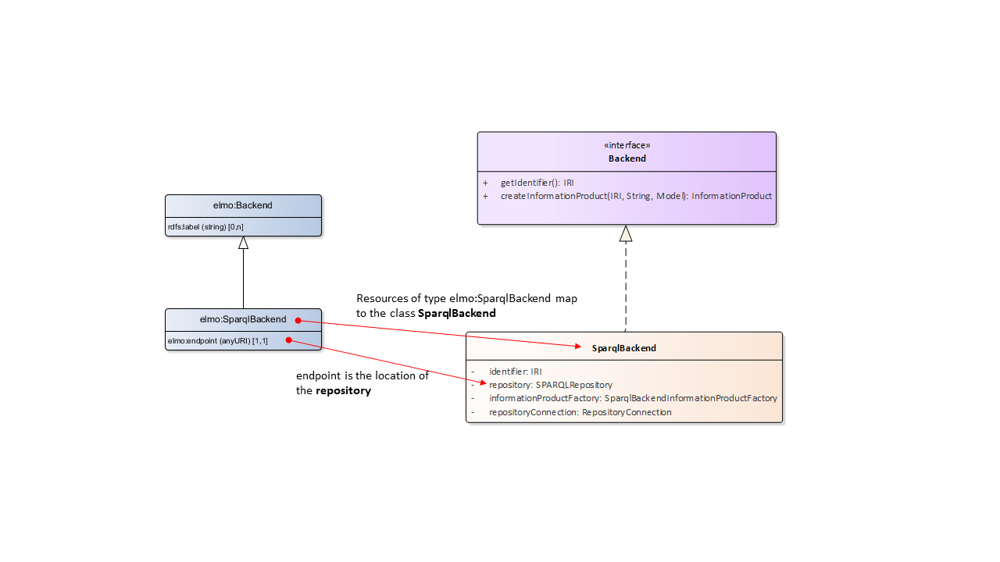
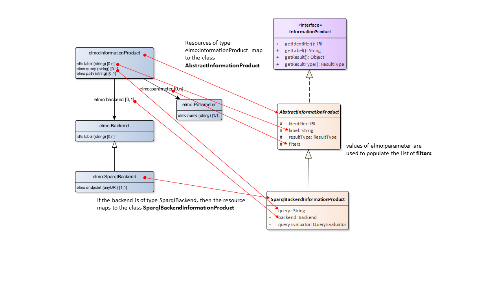
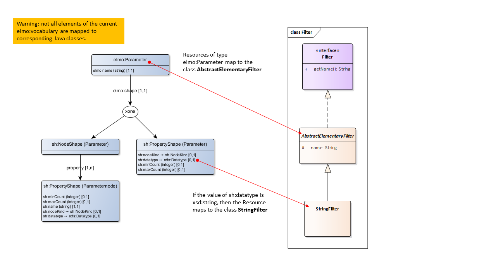

# Elmo mapping

The configuration of the DotWebStack consists of RDF statements. These statements are read from a filesystem or a SPARQL endpoint during start-up of the framework.
All RDF statement are mapped to internal Java Classes. This page describes how the mapping is performed.
The configuration uses a specific elmo vocabulary, along with terms from the shacl, xsd, rdfs vocabularies. All terms are actually IRI's. We will use the following prefixes to refer to these vocabularies:

- elmo: [http://dotwebstack.org/def/elmo#](http://dotwebstack.org/def/elmo#)
- shacl: [http://www.w3.org/ns/shacl#](http://www.w3.org/ns/shacl#)
- xsd: [http://www.w3.org/2001/XMLSchema#](http://www.w3.org/2001/XMLSchema#)
- rdfs: [http://www.w3.org/2000/01/rdf-schema#](http://www.w3.org/2000/01/rdf-schema#)

The diagrams below describe the mapping. The left site shows the elmo vocabulary terms, the right site show the java classes. Mappings are show as red arrows from elmo vocabulary terms to java classes or properties.

The source of the diagrams on the left site is the elmo vocabulary itself. The java class diagram is maintained as an enterprise architect file: [dotwebstack.eap](dotwebstack.eap). The mapping itself is mainted as a powerpoint file: [mapping.pptx](mapping.pptx).

## Mappings

### Backend

### InformationProduct

### Filter
