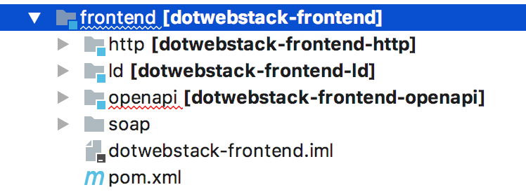
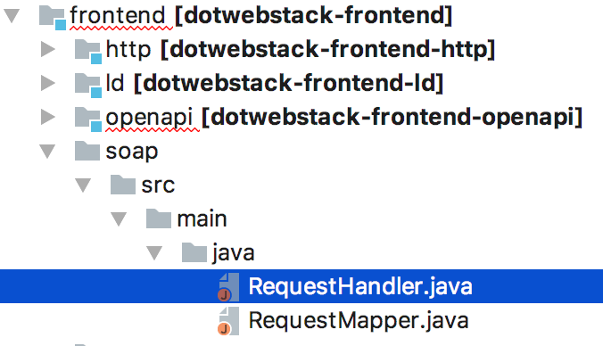

##General Process flow of the dotweb stack framework 
The general process flow of the dotweb stack framework is as follows:
1. The framework identifies the different endpoints that will be available to send requests to. These  endpoints are taken from a configuration file.
2. The endpoints are then registered as a resource with the help of the Jersey framework.
3. When calling a resource, the corresponding information product will be retrieved by the SparQL Backend. After which it will be converted into a response.
To add a new frontend module some required classes and files will have to be added to support this process. This process is described below.

# HOWTO extend the framework

The dotwebstack framework is designed to be extended. The following extention points are available:

- Adding a new front-end module;
- Adding a new back-end;

## Adding a new front-end module
All front-end modules implement and extend [jersey](https://jersey.github.io/) interfaces and classes.

The front-end uses one generic module, [http](https://github.com/dotwebstack/dotwebstack-framework/tree/master/frontend/http), from which all other front-end modules are derived. Among other tasks, the http module will look for other front-end modules and initialize them, so these modules can register the appropiate URL paths.

Currently, two additional front-end modules are available in the dotwebstack-framework repository:

- [ld](https://github.com/dotwebstack/dotwebstack-framework/tree/master/frontend/ld), for returning Linked Data serialisations (RDF/XML, Turtle, JSON-LD) for dereferenceable URI's;
- [openapi](https://github.com/dotwebstack/dotwebstack-framework/tree/master/frontend/openapi), for dealing with RESTful API's that conform to the Open API Specification.

The dotwebstack-theatre-legacy reponsitory contains a third module:

- [ldtlegacy](https://github.com/dotwebstack/dotwebstack-theatre-legacy/tree/master/src/main/java/org/dotwebstack/ldtlegacy), for returning a HTML representation for dereferenceable URI's.

**To create your own new front-end module proceed as follows**
1.) Inside the existing front-end package, create a new folder and give your new module a name. In the example below the soap module has been added.

When the framework identifies the different endpoints, it will extract it from a (predefined) configuration file. Currently the OpenAPI module is reading from OpenAPI Specification / Swagger Specification files. The Linkeddata module reads RDF(.trig) files and  the SOAP module will consider a WSDL file as it’s required configuration file.
The data from the files must be extracted and mapped so that the data can be further processed by the system. 
2.) That is why it is necessary to create a **‘Mapper Class'** and possibly a separate class that takes care of extracting. So the next step is to add one or more Mapper classes. An example of an existing mapper in the OpenAPI module is `OpenApiRequestMapper`.

3.) To eventually handle the retrieved resources, a **'Request Handler Class'** is required. This will process the request and have the correct information product collected by the backend. Other responsibilities of this Handler are the validation of the request, processing of the given parameters and the generation of a response. So the following step is to create your own Handler class.
The classes must implement the Jersey interface called Inflector and thus override the `RESULT apply(DATA var1);` method.
An example from the OpenApi module which uses this is the `InformationProductRequestHandler`class.

Eventually you have created an request handler class and a mapper class. As shown below

If you competed these steps a basic front-end module is created and can be used in.

## Adding a new back-end
To add a new back-end to the dotwebstack-framework (for example a SQL backend) you need to:

- Add a subclass of `elmo:Backend` to the elmo vocabulary (for example: `elmo:SqlBackend`);
- Add a class (`SqlBackend`) and corresponding factory that implements the interface `org.dotwebstack.framework.backend.Backend`;
- Add a class (`SqlBackendInformationProduct`) and corresponding factory that extends the class `org.dotwebstack.framework.informationproduct.AbstractInformationProduct`.

The class `SqlBackend` will contain the configuration information with regard to the operation you need to perform at the backend. For example, you might need a property `query` to specify the particular SQL query and a property `endpoint` to specify the location of the SQL database).

The class `SqlBackendInformationProduct` will implement the actual call to the SQL database. This call will be part of the `getResult` method. Such a call would:

- Merge parameter values with the query;
- Perform the call to the SQL database;
- Transform the result to RDF4j classes.

The last step is a consequency of the architectural design principle that all backends will return RDF data (tuple results or graph results). This greatly reduces the complexity of the framework. The consequence is that this concern is the responsibility of the backend implementor, who will probably has the best knowledge about such transformation!