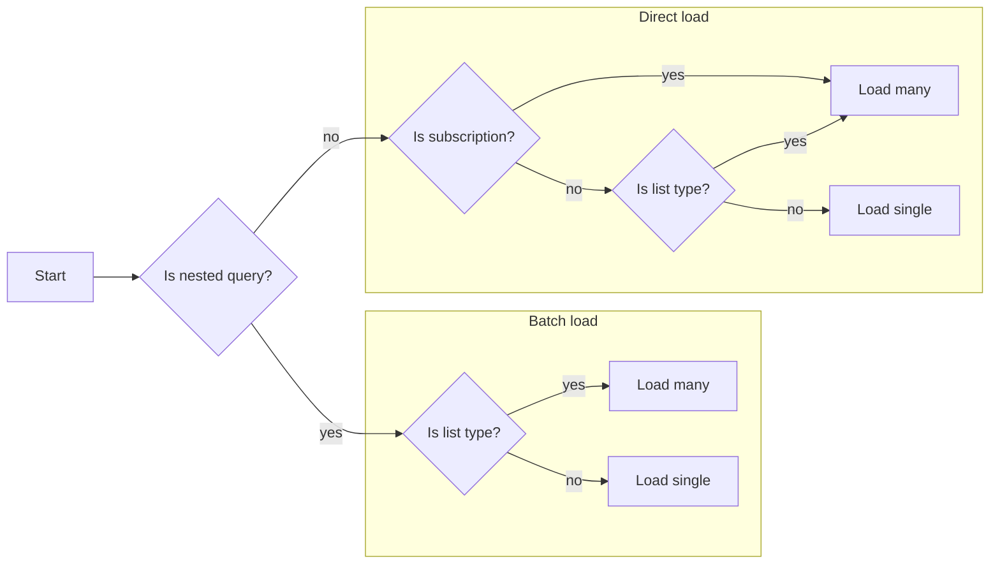

## GenericDataFetcher

```mermaid
graph LR
    A[Start] --> B{Is nested query?}
    B -->|no| H{Is subscription?}
    B -->|yes| E{Is list type?}
        subgraph Batch load
    E --> |yes| F[Load many]
    E --> |no| G[Load single]
    end
    subgraph Direct load
    H --> |yes| I[Load many]
    H --> |no| J{Is list type?}
    J --> |no| K[Load single]
    J --> |yes| I
    end
```